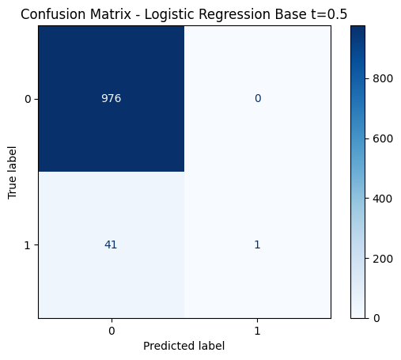
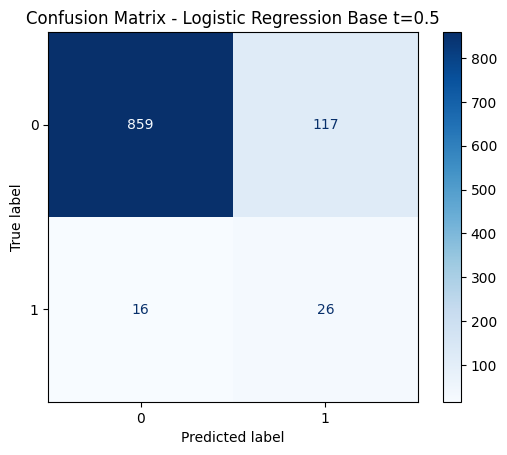
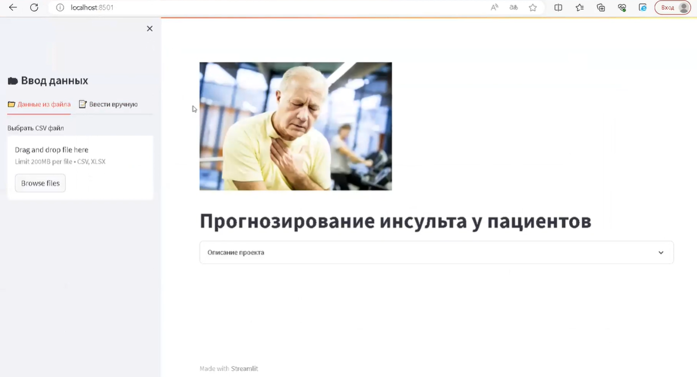
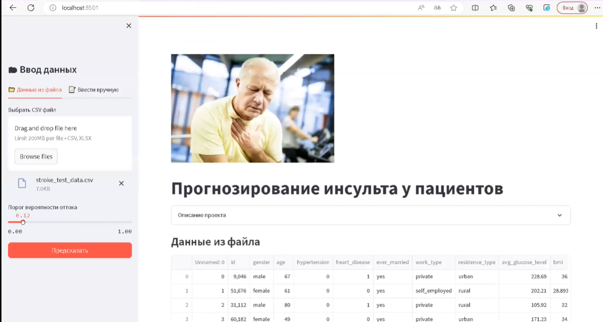
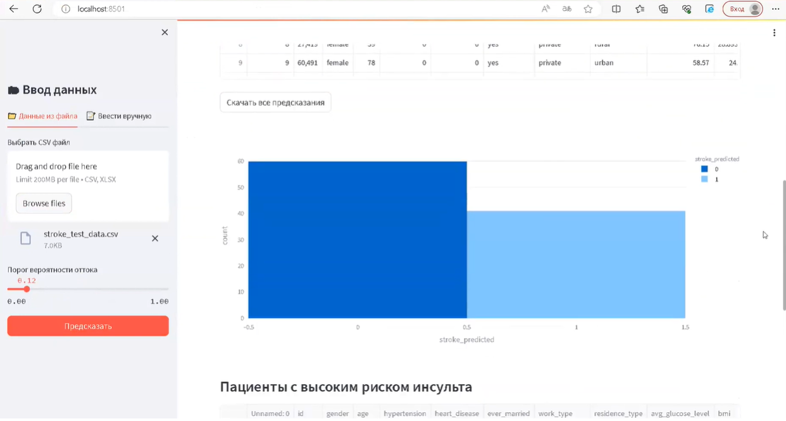
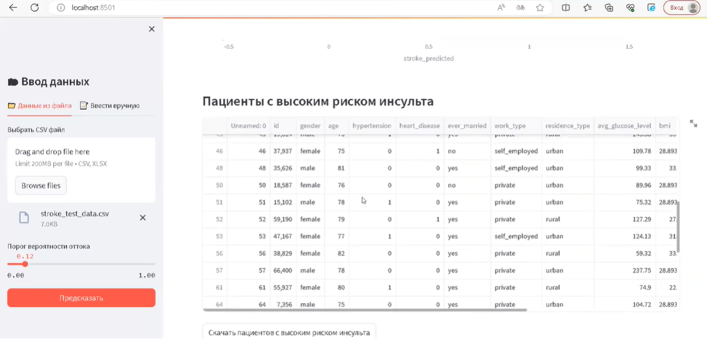
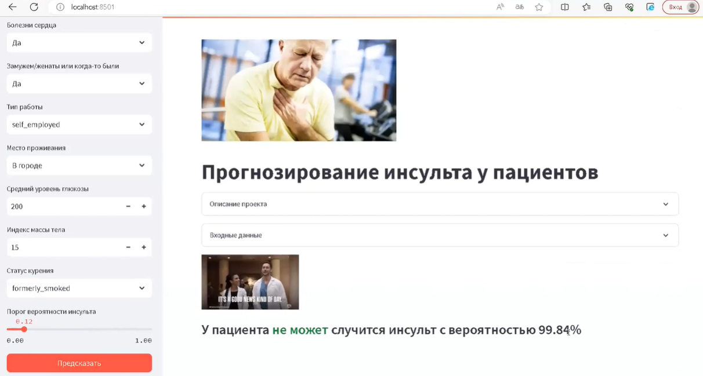

<h1 align="center">
 Бинарная классификация: Stroke Prediction 
</h1>

## Цель
Разработка бинарного классификатора для прогнозирования инсульта и развертывания этой модели на веб-приложение с помощью Streamlit

## Методология
В этом проекте я разработала модель бинарной классификации для прогнозирования инсульта по данным из [Kaggle](https://www.kaggle.com/datasets/fedesoriano/stroke-prediction-dataset ). В дополнении я создала веб-приложение с помощью Streamlit для демонстрации работы этой модели. 

### Данные
Данные в файле [stroke-prediction-dataset.csv](stroke-prediction-dataset.csv)
В данных имеется следующая информация:
1) id: уникальный идентификатор
2) gender: "Male", "Female", "Other" – пол: "Мужской", "Женский" или "Другой"
3) age: возраст пациента
4) hypertension: 0 если у пациента нет гипертонии, 1 если у пациента есть гипертония
5) heart_disease: 0 если у пациента нет заболеваний сердца, 1 если у пациента есть заболевание сердца
6) ever_married: "No", "Yes" – когда либо были в браке: "Нет", "Да"
7) work_type: "children", "Govt_job", "Never_worked", "Private", "Self-employed" – тип работы: "дети", "Государственная работа", "Никогда не работал", "Частное", "Самозанятый"
8) Residence_type: "Rural", "Urban" – тип проживания: "Сельский" или "Городской"
9) avg_glucose_level: средний уровень глюкозы в крови
10) bmi: индекс массы тела
11) smoking_status: "formerly smoked", "never smoked", "smokes", "Unknown" – статус курения: «ранее курил», «никогда не курил», «курит», «Неизвестно»*
12) **stroke**: 1 если у пациента был инсульт или 0, если не было – целевая колонка

### Обучение Модели
Обучение модели в файле [stroke_prediction_model.ipynb](stroke_prediction_model.ipynb). Для обучение модели были проделаны следующие шаги:
1. Подготовка данных
2. Первоначальный анализ данных
3. EDA (Exploratory data analysis)
4. Разделение данных на Train, test, valid
5. One-hot encoding
6. Обучение модели Логистической Регрессии c Scikit-Learn
7. Улучшение модели с помощью
  7.1 поиска лучшего threshold
  7.2 Feature Engineering
  7.3 Min-max normalization
8. Обучение финальной модели
9. Сохранение модели в файл
Финальные сохраненные модели в папке 'lr_model_stroke_prediction.sav' и 'encoding_model.sav' в папке models.

## Результаты

|  Модель                        | Accuracy | Precision |   Recall |	F1 Score |
:------------                    | --------:| ---------:|---------:| ---------:|
| Базовая с t=0.5                | 0.959725 | 1.000000  | 0.023810 | 0.046512  |
| Оптимальный t=0.115	           | 0.869352 | 0.181818  | 0.619048 | 0.281081  |
| Без двух признаков t=0.115     | 0.909627 | 0.142857  |	0.238095 | 0.178571  |
| Нормализация Min-Max  t=0.115  | 0.878193 |	0.174603  | 0.523810 | 0.261905  |
| на тестовых данных             | 0.861357 | 0.214765  |	0.571429 | 0.312195  |
| Финальная сохраненная модель   | 0.874263 | 0.179104  | 0.571429 | 0.272727  |

*тут t - threshold (Порог)

Данные не сбалансированные и люди с инсультом составляют только 5% от общего, поэтому базовая модель прогнозирует, что почти у всех людей не будет инсульта. Это не является допустимым для данной задачи, следовательно я улучшила модель поиском лучшего порога, удалением неэффективных признаков и Min-Max нормализацией. Более того очень важна метрика полноты (recall), так как на кону жизнь и здоровье человека, и нужно как можно больше находить людей с риском инсульта. В таблице внизу, я иллюстрирую матрицы несоответствии до и после улучшении.

 До улучшения: базовая модель | После улучшения
:---------------------------------------:|:------------------------------------------:
                 |           

## Развертывание с StreamLit
Развертывание модели в файле [app.py](app.py).

#### Пример сайта №1: внешний вид сайта

#### Пример сайта №2: загружаете свои данные в виде таблицы и настраиваете порог вручную при необходимости

#### Пример сайта №3: гистограмма результатов

#### Пример сайта №4: можно увидеть и скачать результат прогноза в виде таблицы

#### Пример сайта №4: можно загрузить данные пациента вручную по одному и узнать результат в следующим виде:

